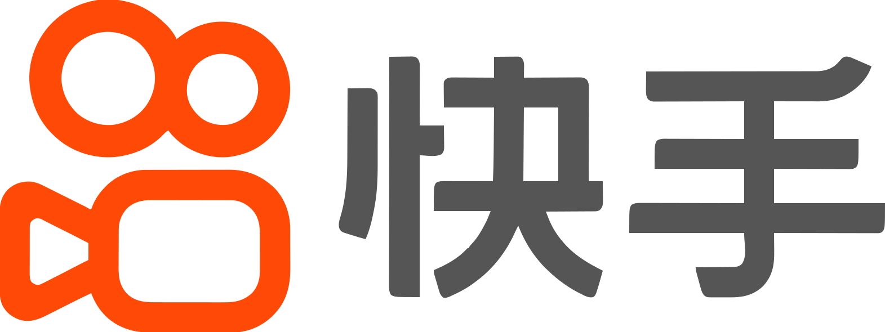

## Hi there 👋

I am currently a research engineer in the Algorithms Research Center, Video Technology of [Kuaishou](https://ir.kuaishou.com/) , based in Beijing, China. I joined Kuaishou in 2020 and I am currently working in [Ming Sun](https://msunming.github.io/)'s team to evaluate and promote the quality of user-generated videos on the Kuaishou platform.

I received my Ph.D. in Fluid Mechanics from [Peking University](https://english.pku.edu.cn/) in 2020, advised by Prof. [Yue Yang](https://en.coe.pku.edu.cn/faculty/facultyaz/891197.htm). I also obtained my B.S. in [Mechanics](https://en.coe.pku.edu.cn/) and [Economics](https://en.nsd.pku.edu.cn/) (double major) from Peking University in 2015.

I'm interested in contributing to video/image processing (restoration and enhancement), generative models, and MLLM research. I have published 10+ papers  at top international AI conferences such as [CVPR](https://cvpr.thecvf.com/), [ECCV](https://eccv.ecva.net/), and [AAAI](https://aaai.org/conference/aaai/aaai-25/). I have also published in top fluid mechanics journals such as the [Journal of Fluid Mechanics](https://www.cambridge.org/core/journals/journal-of-fluid-mechanics).

If you are interested in any form of **academic cooperation**, please do not hesitate to contact me at [haojinhua@kuaishou.com](mailto:haojinhua@kuaishou.com). We are currently looking for interns to join our team!

### 📎 Homepages
- Personal Pages: https://eric-hao.github.io (updated recently🔥)
- Google Scholar: https://scholar.google.com/citations?user=hVMNCSQAAAAJ
- DBLP: https://dblp.org/pid/372/0042.html

### 🔥 News
- *2024.12*: 🎉 One paper is accepted by AAAI 2025.
- *2024.07*: 🎉 Two papers are accepted by ECCV 2024.
- *2024.02*: 🎉 Two papers are accepted by CVPR 2024.
- *2020.07*: I join Kuaishou  as a research engineer in Beijing.

### 💻 Selected Research Papers

My full paper list is shown at [my personal homepage](https://eric-hao.github.io).

### 🖥️ Computer Vision
- ``AAAI 2025`` [Plug-and-Play Tri-Branch Invertible Block for Image Rescaling](https://arxiv.org/abs/2412.13508), Jingwei Bao, **<u>Jinhua Hao*</u>**, Pengcheng Xu, Ming Sun, Chao Zhou, Shuyuan Zhu. 
- ``ECCV 2024`` [OAPT: Offset-Aware Partition Transformer for Double JPEG Artifacts Removal](https://www.ecva.net/papers/eccv_2024/papers_ECCV/papers/03228.pdf), Qiao Mo, Yukang Ding, **<u>Jinhua Hao*</u>**, Qiang Zhu, Ming Sun, Chao Zhou, Feiyu Chen, Shuyuan Zhu. 
- ``CVPR 2024`` [CPGA: Coding Priors-Guided Aggregation Network for Compressed Video Quality Enhancement](https://openaccess.thecvf.com/content/CVPR2024/papers/Zhu_CPGA_Coding_Priors-Guided_Aggregation_Network_for_Compressed_Video_Quality_Enhancement_CVPR_2024_paper.pdf), Qiang Zhu, **<u>Jinhua Hao</u>**, Yukang Ding, Yu Liu, Qiao Mo, Ming Sun, Chao Zhou, Shuyuan Zhu.  
- ``ECCV 2024`` [XPSR: Cross-modal priors for diffusion-based image super-resolution](https://www.ecva.net/papers/eccv_2024/papers_ECCV/papers/01755.pdf), Yunpeng Qu, Kun Yuan, Kai Zhao, Qizhi Xie, **<u>Jinhua Hao</u>**, Ming Sun, Chao Zhou.  
- ``CVPR 2024`` [PTM-VQA: Efficient Video Quality Assessment Leveraging Diverse PreTrained Models from the Wild](https://openaccess.thecvf.com/content/CVPR2024/papers/Yuan_PTM-VQA_Efficient_Video_Quality_Assessment_Leveraging_Diverse_PreTrained_Models_from_CVPR_2024_paper.pdf), Kun Yuan, Hongbo Liu, Mading Li, Muyi Sun, Ming Sun, Jiachao Gong, **<u>Jinhua Hao</u>**, Chao Zhou, Yansong Tang.

### 🌊 Fluid Mechanics
- ``JFM`` [Magnetic knot cascade via the stepwise reconnection of helical flux tubes](https://www.researchgate.net/profile/Yue-Yang-11/publication/349411681_Magnetic_knot_cascade_via_the_stepwise_reconnection_of_helical_flux_tubes/links/602f631392851c4ed58062be/Magnetic-knot-cascade-via-the-stepwise-reconnection-of-helical-flux-tubes.pdf), **<u>Jinhua Hao</u>**, Yue Yang, _Journal of Fluid Mechanics_, _2021_.  

- ``JFM`` [Tracking vortex surfaces frozen in the virtual velocity in non-ideal flows](https://www.researchgate.net/profile/Yue-Yang-11/publication/330640967_Tracking_vortex_surfaces_frozen_in_the_virtual_velocity_in_non-ideal_flows/links/5c4bb76692851c22a3911051/Tracking-vortex-surfaces-frozen-in-the-virtual-velocity-in-non-ideal-flows.pdf), **<u>Jinhua Hao</u>**, Shiying Xiong, Yue Yang, _Journal of Fluid Mechanics_, _2019_.  